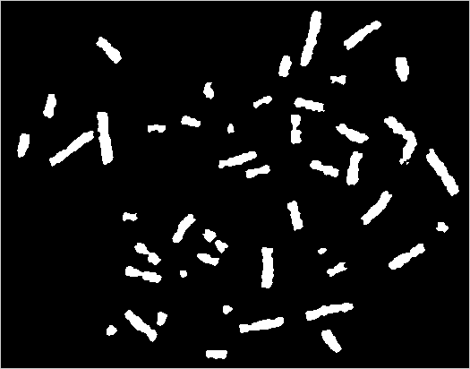

--------------------- 
作者：Triple-L 
来源：CSDN 
原文：https://blog.csdn.net/u013369277/article/details/50750738   
版权声明：本文为博主原创文章，转载请附上博文链接！  
调用的框架：http://blog.chinaunix.net/uid-20622737-id-3173056.html  
实验内容：  
对于下面这幅图像，编程实现染色体计数，并附简要处理流程说明。 

处理步骤： 
1. 读取图像，转换为灰度图像  
平滑滤波去噪  
图像二值化  
对图像进行膨胀  
再次膨胀(视情况而定)  
腐蚀（视情况而定）  
反转  
统计连通区域个数并输出  
保存图像

```
void main()
{
    Bitmap *bmp = (Bitmap *)malloc(sizeof(Bitmap));// build an empty bmp to put the img.空变量呈放图片
    Bitmap *dstBmp = (Bitmap *)malloc(sizeof(Bitmap));
    Bitmap *graybmp = (Bitmap *)malloc(sizeof(Bitmap));
    Bitmap *smoothbmp = (Bitmap *)malloc(sizeof(Bitmap));
    Bitmap *binbmp = (Bitmap *)malloc(sizeof(Bitmap));
    Bitmap *temp = (Bitmap *)malloc(sizeof(Bitmap));
    int ret;
    char *path ="C:\\Users\\Ali\\Desktop\\1.bmp";
    ret = ReadBitmap(path, bmp);//读取图片
    char *savePath ="C:\\Users\\Ali\\Desktop\\zuizhong.bmp";
    RGB2Gray(bmp,graybmp);//转换成灰度图
    smooth(graybmp,smoothbmp);
    Gray2BW(smoothbmp,binbmp,155);//二值化
    pengzhang(binbmp, dstBmp);  
    pengzhang(dstBmp, temp);
    fushi(temp,dstBmp);
    qufan(dstBmp,temp);
    /*BYTE *bitmap = temp->imageData;
    int width = temp->width;
    int height = temp->height;
    int *labelmap;
    ConnectedComponentLabeling(bitmap, width, height,labelmap); 有待调整 此处是调用本博客的另一篇文章
    二值图像统计连通区域*/
    SaveBitmap(savePath,temp);//保存图片    
}
```
Result:

